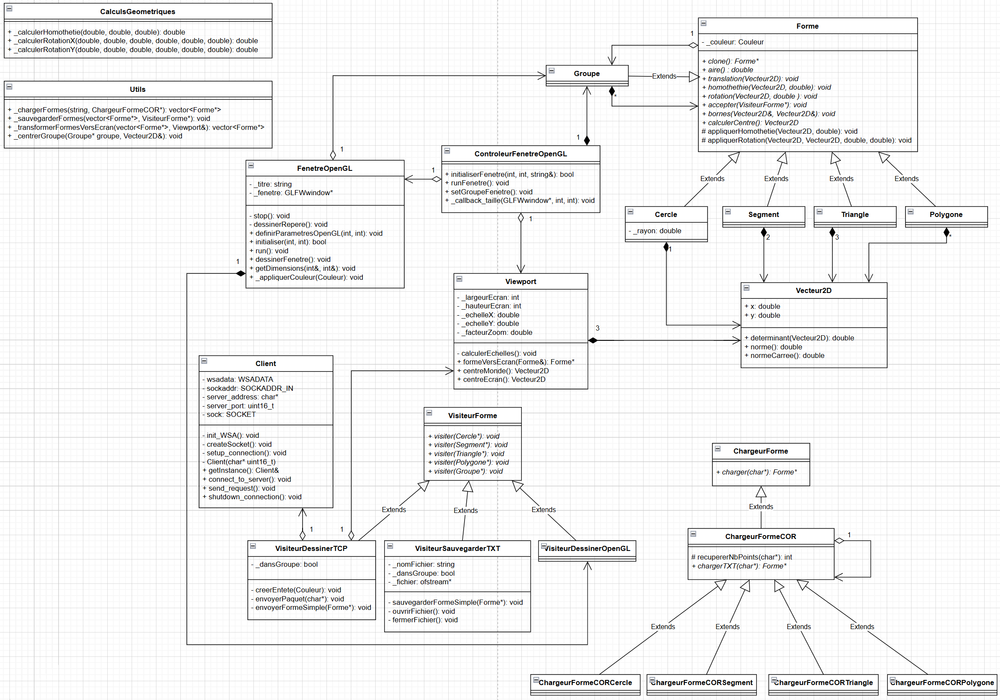

# Projet de synthèse de L3




## Description

Ce projet à pour but d'afficher des formes géométriques en 2D à l'aide de différentes méthodes de rendu. Il permet de charger des formes depuis un fichier texte, les sauvegarder, ainsi que de les afficher à l'écran. Le projet est divisé en deux parties : une partie C++ (client) et une partie Java (serveur).

### Partie C++

La partie C++ est composée de plusieurs classes permettant de gérer les formes géométriques. C'est cette partie qui se charge gérer les transformations mathématiques des formes pour pouvoir les afficher à l'écran. Une extension de cette partie permet de dessiner les formes à l'aide de la librairie OpenGL.

### Partie Java

La partie Java joue le role de serveur. Elle s'occupe de dessiner les formes que le client lui envoie via un socket.


## Convention des fichiers

Chaque ligne des fichiers de formes doit respecter la convention suivante :

``` plaintext
nombre_de_points x1 y1 x2 y2 ... xn yn
```


## Dépendances

### Obligatoires

Pour pouvoir compiler et exécuter ce projet, les dépendances suivantes sont requises :

- **Windows**: Le projet est conçu pour fonctionner sous Windows.
- **MinGW Make ou Make**: Pour construire le projet.
- **GCC**: Pour compiler le code C++.
- **Java SDK**: Pour compiler le code Java.
- **OpenGL (inclu)**: Pour l'affichage graphique de la partie C++.

### Optionnelles

- **Doxygen**: Pour générer la documentation du code C++.
- **JSDoc**: Pour générer la documentation du code Java.
- **GoogleTest**: Pour exécuter les tests unitaires.


## Compilation et Exécution

1. **Compiler le projet :**
```bash
make all
```
ou, si MinGW Make est utilisé :
```bash
mingw32-make all
```

2. **Exécuter le programme :**
```bash
make run
```
ou, si MinGW Make est utilisé :
```bash
mingw32-make run
```


## Commandes Makefile

Voici la liste des commandes disponibles dans le **Makefile** :

- `make all` : Compile tout le projet.
- `make rebuild` : Nettoie et recompile tout le projet.
- `make run` : Exécute le programme C++.
- `make test` : Compile et exécute les tests unitaires.
- `make javac` : Compile le code Java.
- `make run-java` : Exécute le programme Java.
- `make clean` : Supprime les fichiers objets.
- `make delete` : Supprime l'exécutable principal.
- `make deletetest` : Supprime l'exécutable des tests.
- `make cleanall` : Supprime les fichiers temporaires et binaires.
- `make docs` : Génère la documentation.
- `make help` : Affiche la liste des commandes disponibles.


## Documentation

La documentation complète du projet (C++ et Java) est disponible au format HTML dans le dossier `docs/`.